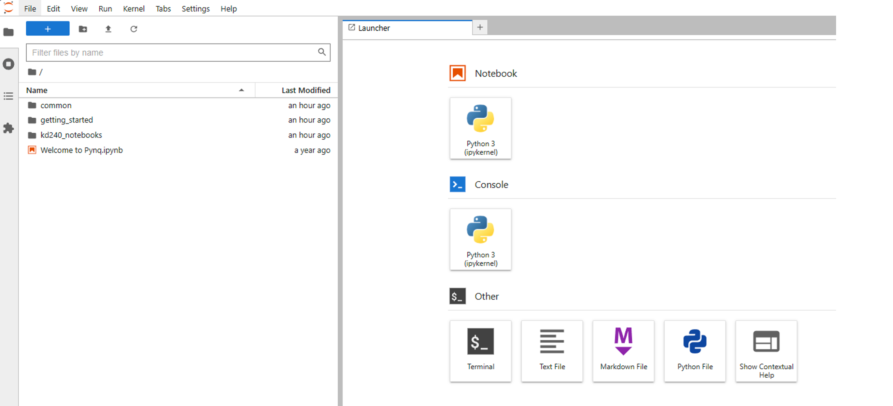

# KD240 Face Detect
+ This article explains how to perform AI face detection on KD240

**Last update: 2024/05/18**

## Download Ubuntu 22.04
You can download the file from the following link
[Install Ubuntu on AMD | Ubuntu](https://ubuntu.com/download/amd)

​

## Setting Up the SD-Card Image 
Use [balenaEtcher](https://etcher.balena.io/) to burn the downloaded file to the SD card

You can also refer to the official steps for burning

[Setting up the SD Card Image (xilinx.com)](https://www.xilinx.com/products/som/kria/kd240-drives-starter-kit/kd240-getting-started/setting-up-the-sd-card-image.html)


Insert the SD card into the SD card slot of the KD240 as shown below


## Power on KD240

After powering on as shown below, open [MobaXtern](https://mobaxterm.mobatek.net/download.html) and communicate with KD240 via UART


## Set Ubuntu environment and download Xilinx package
### 1. Login credentials
```
Account: ubuntu
Password: ubuntu
```

### 2. Enter the following commands to update and install Kria-PYNQ
```
sudo apt update
sudo apt upgrade
git clone https://github.com/Xilinx/Kria-PYNQ.git
cd Kria-PYNQ
~~Change line 242 in install.sh ---> cp -r pynq_dpu/kd240_notebooks /root/jupyter_notebooks/ (This issue has been fixed by the manufacturer)~~
sudo bash install.sh -b KD240
sudo reboot
```
+ After successful installation, you will see the following message


## Start Demo
### 1. Enter the provided URL, e.g., 10.8.3.232:9090/lab, and enter the password: xilinx. You will see the following screen


### 2. Click on kd240_notebooks
+ Enter run_face_detection.ipynb, where you will find that the file calls faceDetection.py, which in turn imports utils.py
+ Click on the yellow play button in run_face_detection.ipynb to execute the program step by step


### Result
+ The results will be displayed on the screen, and you can test with your own images

